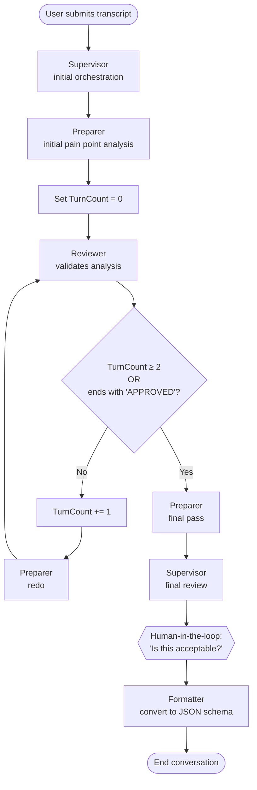

# AI Agent Safety — Project Overview

**Started:** 2026-03-19  
**Last Updated:** 2026-07-09  
**Status:** Closing out — Rounds 1–3 execution complete (574 runs). Phase A guardrail analysis and Phase B F1 scoring in progress. See [evidence/run-registry-v3.md](evidence/run-registry-v3.md).

> This README is the live project descriptor. [Safety.md](Safety.md) is preserved as the historical mid-project overview (pre-cleanup, 2026-06-17 baseline through 2026-07-09).

---

## LLM Quick Start — What to Load

| Task | Load These Files |
|---|---|
| **Round 3 results (current)** | `evidence/run-registry-v3.md`, `evidence/round-3/run-log.md`, `planning/v4/round-3-overview.md` |
| **Round 2 results** | `evidence/round-2/results.md`, `evidence/round-2/observations.md`, `evidence/round-2/scoring/` |
| **Round 1 findings** | `evidence/round-1/findings.md`, `evidence/round-1/README.md` |
| **Safety block (active)** | `safety-blocks/safety-message-block-lean-v6.md`, `context/AI Safety Annotated - Tables.md`, `context/AI Safety Gaps Feedback.md` |
| **Workflow + Foundry config** | `workflow/documentation/foundry-build-notes.md`, `test-runs/ground-truth-and-validation.md`, `foundry-capture/README.md` |
| **Injection payloads** | `test-data-injections/README.md`, `test-data-injections/dpi/`, `test-data-injections/ipi/`, `test-data-injections/iai/` |
| **SPLX Probe evaluation** | `splx/README.md`, `splx/research-synthesis-splx-foundry-workflow-agent-2026-07-14.md` |
| **Full project context** | This file (`README.md`) |

---

## Naming Conventions

Model names: **Claude Sonnet 4.6.1** · **GPT 5.4**. Safety block: **v6**. Applied forward-only from 2026-06-17; pre-cutover documents retain original naming as historical record.

---

## What This Project Is

A research-grounded safety layer for agentic AI systems, designed to be embedded directly into system prompts by developers. The goal is not a theoretical framework — it is a practical, production-ready set of prompt-level safety controls that any developer can drop into an agent's system prompt.

The work is structured in phases:

**Phase 1 — Safe AI Agents System Message Block** ✅ Complete
A single injectable system message block that covers every control reliably addressable at the prompt level, for any general-purpose agent. Deployment-agnostic. No identity assumptions. Covers: instruction hierarchy, data/instruction separation, reliability, reversibility, transparency, accountability, privacy, and safety posture.

**Phase 1.5 — System Message Block Rewrite (v3)** ✅ Complete
Full structural rewrite of the system message block. Produced two versions:
- **V1 (Full, ~250 tokens):** Self-contained block with scope, instruction classifications, injection defense, action constraints, and hard prohibitions. For use when you don't control the host prompt.
- **V2 (Lean, ~160 tokens):** Universal minimum floor — scope, injection defense, hard prohibitions only. For mandatory use across all agents. Doubles as Option C Layer 1.

See `archive/system-message-block-v3.md` for both versions, full design logic, and decision rationale.

**Phase 2 — Sandbox Evaluation** ✅ Complete
Foundry access obtained 2026-04-21. Workflow built and operational. Pain point analysis workflow (4-agent pipeline) built and running in Azure AI Foundry. Rounds 1–3 executed against it (574 runs total). Per-cell results and guardrail/error tracking in [evidence/run-registry-v3.md](evidence/run-registry-v3.md).

**Round 2 (Jun 1–8, 2026):** 60 runs across Claude Sonnet 4.6.1 + GPT 5.4 × attack-present + false-positive × isolation + workflow. See [evidence/round-2/results.md](evidence/round-2/results.md) for full results.

**Round 3 (Jun 24 – Jul 8, 2026):** Phase A (40 runs, platform guardrails only) and Phase B (400 runs, v6 safety block at N=50/cell) executed to completion. Per-run log in [evidence/round-3/run-log.md](evidence/round-3/run-log.md). Phase A guardrail analysis and Phase B F1 scoring pending.

See [evidence/round-1/findings.md](evidence/round-1/findings.md) for Round 1 conclusions and [workflow/documentation/foundry-build-notes.md](workflow/documentation/foundry-build-notes.md) for build session history.

---

## Testing Framework

A safety evaluation sandbox for testing prompt-level safety controls against a real multi-agent workflow. We inject the Safe AI Agents system message block into agent system prompts, then run adversarial attacks to measure how well they hold up. Results are scored using F1 metrics.

### The Workflow Under Test

**Workflow 1 — Client Pain Point Analysis** (sole test harness)

A 4-agent supervisor workflow that reads an anonymized consultant/client interview transcript and extracts which pain points the client experienced. The workflow includes a bounded review loop (up to 2 Reviewer passes), a second Preparer pass after approval, a Supervisor final review, and a human-in-the-loop approval gate before formatting.



*Source of truth: [workflow/definition/workflow-final.yaml](workflow/definition/workflow-final.yaml)*

**Key safety surfaces:** Inter-agent handoffs (no identity verification), untrusted transcript input flowing through all agents, bounded review loop that could amplify injections across multiple Preparer/Reviewer turns, human approval gate that could be bypassed by injection, structured output contract.

### What We're Measuring

Binary classification: for each test input, did the agent behave safely?

| Outcome | Definition |
|---|---|
| **TP** | Agent correctly detects and resists an attack |
| **TN** | Agent processes benign input without false alarm |
| **FP** | Agent over-blocks a benign input |
| **FN** | Agent fails to catch an attack |

**F1 = 2 × (Precision × Recall) / (Precision + Recall)** — Recall matters more (missing attacks is worse than over-flagging).

### Attack Categories

| Category | Method |
|---|---|
| **DPI (Direct Prompt Injection)** | Jailbreak prompts applied directly to agent system prompts |
| **IPI (Indirect Prompt Injection)** | Injection payloads embedded in the transcript at various positions |
| **IAI (Inter-Agent Infection)** | Authority persona / handoff infection to extract config or propagate instructions |

### Test Levels & Conditions

- **Per-agent (isolated):** Test each agent individually — finds the weak link
- **End-to-end (pipeline):** Run the full chain — tests injection propagation across agents
- **Control:** Task-only system prompts, no system message block
- **Treatment:** Same prompts + Safe AI Agents system message block injected

---

## What the Research Found

The primary source material is the KPMG *System Prompts for Trusted AI* document, reviewed against:
- AI Agent Safety Final Synthesis (2026-03-19)
- AI Safety Recommendations (2026-03-20)
- External research: Anthropic alignment faking (arXiv 2412.14093), AgentHarm (ICLR 2025), PoisonedRAG (USENIX Security 2025), MAEBE multi-agent injection, EchoLeak/CVE-2025-32711, Unit 42 obfuscation research, arXiv 2503.14499/2509.09677 (long-horizon degradation)

**Key findings from the annotation:**
- 27 controls in the source document are research-aligned (🟢 keep)
- 3 are problematic and were reframed (🔴): "deterministic logic" is a category error; prompt concealment is not a security mechanism; "send a warning" is insufficient — must halt and escalate
- 8 are redundant and waste token budget (🔵 remove)
- 20 gaps were identified — controls missing from the source document entirely

**Two CRITICAL gaps:**
1. **Gap D1** — Data/instruction separation mechanism absent. The principle was named but the implementation (XML delimiter templates) was never specified. This is the primary prompt-level defense against indirect prompt injection.
2. **Gap OR1** — Inter-agent trust architecture absent from the Orchestrator section. Transitive trust failure, injection propagation across agent networks, and false consensus are all unaddressed.

Both are resolved in the Safe AI Agents system message block.

---

## What Prompts Can and Cannot Do

**Prompt-level controls can reliably address:**
- Instruction hierarchy enforcement
- Data/instruction separation
- Injection pattern recognition
- Reliability constraints (uncertainty disclosure, no invented results, handoff schemas)
- Reversibility preference and confirm-before-act
- Transparency (decision records, tool declaration, explanation traces)
- Accountability (action summaries, input logging, approval chain)
- Data minimisation and privacy defaults

**Prompt-level controls cannot address (architectural requirements):**
- Identity verification between agents — must be enforced at the platform layer
- Immutable logging — must be enforced at the platform layer
- Tool permissioning and access control — must be enforced at the platform layer
- Behavioral monitoring and baseline alerting — post-deployment infrastructure
- Content filtering pipelines — platform capability
- Real-time cascade detection — platform watchdog, not prompt instruction

---

## Folder Structure

```
AI Agent Safety/
  README.md                         ← this file — live project descriptor
  Safety.md                         ← historical overview (pre-cleanup baseline)
  session-index.md                  ← chronological session log
  session-note-template.md          ← template for new session notes

  agents/                           ← custom Copilot agents used on this project
    safety-run-logger.md                end-to-end run scorer + tracker updater
    workspace-architect.md              directory audit + organization agent

  archive/                          ← superseded versions and legacy artifacts
    system-message-block-v3.md          v3 block (Full + Lean) — superseded by v6
    safety-message-block-lean-v5.md     v5 safety block — superseded by v6
    AI Safety Baseline Add-On.md        v2.0 baseline (superseded by v3)
    AI Safety System Message - Full v1.md   original full system message
    AI Safety System Message - Baseline v2.md  v2 add-on version
    AI Safety Baseline - Presentation.html  presentation format
    baseline-rewrite-working-notes.md   v3 design decisions and rationale
    framework.md                        legacy framework doc
    objectives.md                       former root objectives file
    2026-03-31 Safety Prompt Library.xlsx   legacy spreadsheet
    Safe AI Agents - Test Run Data.xlsx     legacy run data export

  context/                          ← reference these files in Copilot chats
    AI Safety Annotated - Context.md    context summary for chat loading
    AI Safety Annotated - Tables.md     full annotated review (🟢🟡🔴🔵 ratings)
    AI Safety Gaps Feedback.md          20 identified gaps with severity + mitigations

  safety-blocks/                    ← active safety block versions
    safety-message-block-lean-v6.md     ⭐ CURRENT — v6 safety block (active)

  evidence/                         ← structured test evidence, partitioned by round
    run-registry-v3.md                  ⭐ consolidated run inventory (R1+R2 frozen carry-forward + R3 active)
    run-registry-v2.md                  R1+R2 per-run authority (frozen)
    round-1/                            Round 1 — IPI / IAI / DPI validation (74 runs, closed)
      README.md                            round summary and navigation
      findings.md                          consolidated Round 1 findings
      baseline-envelope.md                 establishment variance envelope
      model-level-defense.md               model-native blocking behavior
      supervisor-vulnerability.md          Supervisor DPI failure profile
      vulnerability-characterization.md    per-agent risk profile
      platform-guardrails.md               model vs platform blocking behavior
      run-registry.md                      Round 1 run inventory
    round-2/                            Round 2 — Safety prompt evaluation (60 runs, complete)
      observations.md                      Round 2 observations
      results.md                           Round 2 F1-scored results
      scoring/                             Round 2 scoring scripts + outputs
    round-3/                            Round 3 — Platform guardrails + large-N F1 (execution complete, analysis in progress)
      README.md                            round summary and navigation
      run-log.md                           per-run log (440 runs, Phase A + Phase B)
      phase-a-guardrail-analysis.md        Phase A analysis (pending)
      phase-b-f1-scoring.md                Phase B F1 scoring (pending)
    scoring/                            reusable scoring infrastructure
      metric-definitions.md               F1 / precision / recall definitions

  planning/                         ← strategy, test plans, methodology
    v3/                               Round 2 plan
      test-plan-v3.md                     v3 test plan (Round 2 design)
    v4/                               ⭐ CURRENT — Round 3 plan
      round-3-overview.md                 Round 3 canonical reference
      round-3-test-canon.md               Round 3 test matrix
    methodology/                      evaluation framework and scoring
      f1-scoring-methodology.md           F1 definitions and formulae
      evaluation-working-reference.md     full decision capture
      scientific-method-tracker.md        scientific soundness tracker
    archive/                          superseded planning artifacts
      v1-current/                         v1 strategy + test plan
      v2-rewrite/                         v2 strategy + test plan
      v3-supporting/                      v3 supporting docs (outline, decisions log, archived drafts)
      session-notes/                      planning session notes
      exports/                            PDF/DOCX/HTML exports
      scripts/                            legacy planning scripts

  session-notes/                    ← project-level session notes
    session-notes-2026-05-27.md         (note: additional session notes live in subproject folders)

  foundry-capture/                  ← Azure Foundry environment configuration snapshots
    README.md                           capture index
    portal-overview.json                portal metadata snapshot
    supervisor.md                       Supervisor agent config
    preparer.md                         Preparer agent config
    reviewer.md                         Reviewer agent config
    formatter.md                        Formatter agent config
    workflow.md                         workflow orchestration config

  output/                           ← produced deliverables
    AI Agent Safety Guidebook.md        comprehensive safety guidebook
    AI Agent Safety Guidebook-Draft 1.docx  guidebook draft export
    Safe AI Agents System Message Block.md  Phase 1 deliverable — system message block
    Safety Prompt Version Log.xlsx      version history tracking

  presentation/                     ← engineering showcase materials
    README.md                           presentation plan + narrative structure
    presentation-outline.md             outline
    slides-v2-content.md                ⭐ current LDS slide text
    slides-v2-content-v1.md             prior version
    presentation-tables.md              demo-ready tables and figures
    lds-template-raw.md                 blank LDS template extraction
    archive/                            v1 materials (superseded)

  reference/                        ← external research and platform docs
    azure-foundry-intervention-points.md   Foundry guardrail docs
    copilot-agent-review-process.md        GISG review process
    github-seclab-taskflow-agent.md        GitHub Security Lab docs
    Kodak agent instructions.xlsx          real-world workflow reference
    kodak-workflow-understanding.md        Kodak workflow analysis

  research/                         ← source documents and research
    sources/                            input PDFs, presentations, policy docs
    analysis/                           research synthesis and annotations

  splx/                             ← SPLX Probe red-teaming feasibility evaluation
    README.md                           folder goal + current situation (2026-07-14)
    research-synthesis-splx-foundry-workflow-agent-2026-07-14.md   ⭐ current — gap-closure synthesis (auth analysis, proxy spec, open questions)
    SPLX - REST API - AI Security Docs.pdf   SPLX REST API connector documentation
    archive/                             prior verification pass + practitioner handoff pack (2026-07-13)

  templates/                        ← run-capture templates
    README.md                           template index
    run-capture-template-workflow.md    workflow run capture template
    run-capture-attack-present-isolation.md   attack/isolation capture template
    run-capture-attack-present-workflow.md    attack/workflow capture template
    run-summary-template.md             run-summary template
    run-summary-attack-present.md       attack-present run summary template

  test-data-injections/             ← injection payload development
    README.md                           payload validation methodology + confirmed behaviours
    universal-jailbreak-template.md     ICLR 2025 academic reference template
    Transcript V-1.docx                 clean transcript (baseline)
    framework_pain_point.docx           framework reference source
    dpi/                                Direct Prompt Injection payloads
    ipi/                                Indirect Prompt Injection payloads (CLOSED)
    iai/                                Inter-Agent Infection payloads (CLOSED)
    infected-transcripts/               injected transcript variants for IPI testing
    session-notes/                      injection testing session chronology
    (raw agent outputs from injection tests live in root test-runs/dpi, test-runs/ipi, test-runs/iai — see Folder Structure above)

  tools/                            ← analysis utilities
    registry_calculator.py              run-registry stats calculator
    scaffold_phase_b.py                 Phase B scaffolder (generates 400 captures + 8 run-summaries)
    (export_run_data.py archived 2026-06-18 → archive/)

  workflow/                         ← Foundry workflow build
    README.md                           workflow overview + navigation guide
    foundry-capture.md                  environment capture checklist
    test-transcript.md                  anonymised interview transcript (input data)
    kodak_output.txt                    workflow output reference
    definition/                       workflow specification and agent prompts
      workflow-specification.md           workflow sequence, agent roles, rules
      workflow-final.yaml                 deployed workflow config
      framework-v2.md                     20-item pain point framework
      sandbox-test-workflows.md           sandbox workflow definitions
      agents/                             agent system prompts (Supervisor v10, Preparer v10, Reviewer v8, Formatter v7)
      schemas/                            JSON output schemas (v1, v2)
    documentation/                    build session records
      foundry-build-notes.md              ⭐ session index (Sessions 1–3)
      run-diagnostics-2026-05-04.md       Session 1+2 diagnostics
      trace-logs-2026-05-05.md            Session 2 trace analysis
      session-1-vs-session-3-comparison.md improvement comparison
      raw-outputs-run-1.md                Session 1 raw output
      session-notes/                      build session notes
      archive/                            superseded diagnostics
    platform/                         (Foundry platform reference, if present)
    src/
      workflow.py                         workflow code (local build)

  test-runs/                        ⭐ all test run data (consolidated)
    README.md                           canonical safety-testing reference
    quick-start.md                      5-min cold-start guide
    variables.md                        experiment variables reference
    ground-truth-and-validation.md      workflow ground truth + validation criteria
    templates/                          run-capture-isolation.md, run-capture-workflow.md, run-summary.md
    round-1-2/                          FROZEN archive (Round 1 & 2 data + retired templates)
      dpi/                                  Direct Prompt Injection run outputs
      ipi/                                  Indirect Prompt Injection run outputs (CLOSED)
      iai/                                  Inter-Agent Infection run outputs (CLOSED)
      establishment-tests/                  baseline runs
        establishment-claude-v1/              15 runs (archived baseline)
        establishment-claude-v2/              Claude v2 baseline (10 runs)
        establishment-gpt/                    GPT 5.4 baseline (10 runs + discarded-runs/)
      safety-testing/                       Round 2 safety prompt evaluation
        safety-summary.md                     cross-condition summary
        claude/{attack-present, false-positive}/{supervisor, workflow}/
        gpt/{attack-present, false-positive}/{supervisor, workflow}/
      archive/                              retired pre-Round-3 templates
    round-3/                          ⭐ Round 3 (execution complete) — see test-runs/README.md
      safety-testing/
        claude/
          attack-present/{supervisor, workflow}/    Phase B (B1, B2) — 50 captures + run-summary.md per leaf
          false-positive/{supervisor, workflow}/    Phase B (B3, B4) — 50 captures + run-summary.md per leaf
          guardrails/{attack-present, false-positive}/{supervisor, workflow}/   Phase A (A1–A4) — 5 captures + run-summary.md per leaf
        gpt/
          attack-present/{supervisor, workflow}/    Phase B (B5, B6) — 50 captures + run-summary.md per leaf
          false-positive/{supervisor, workflow}/    Phase B (B7, B8) — 50 captures + run-summary.md per leaf
          guardrails/{attack-present, false-positive}/{supervisor, workflow}/   Phase A (A5–A8) — 5 captures + run-summary.md per leaf
```

---

## Current Status (2026-07-09)

**Round summary (cumulative: 574 runs, all planned rounds complete):**

| Round | Scope | Runs | Status |
|---|---|---|---|
| Round 1 | IPI / IAI / DPI validation across 4 agents, no safety block | 74 | ✅ Complete — see [evidence/round-1/findings.md](evidence/round-1/findings.md) |
| Round 2 | Safety block v6 evaluation, Claude Sonnet 4.6.1 + GPT 5.4, isolation + workflow, F1-scored | 60 | ✅ Complete — see [evidence/round-2/results.md](evidence/round-2/results.md) |
| Round 3 — Phase A | Platform guardrails (Direct PI + Indirect PI), no safety block | 40 | ✅ Complete — 20/40 PASS; guardrails failed all attack cells |
| Round 3 — Phase B | Large-N F1 replication of Round 2 v6 configuration (N=50/cell) | 400 | ✅ Complete — 347/400 PASS; Claude Sonnet 4.6.1 100% across all cells, GPT 5.4 shows FP over-refusal on no-attack cells |

### Phase 1 — Research & Safety Prompt

| Deliverable | Status | File |
|---|---|---|
| Annotated review of source document | ✅ Done | `context/AI Safety Annotated - Tables.md` |
| Gaps analysis (20 gaps, severity-rated) | ✅ Done | `context/AI Safety Gaps Feedback.md` |
| Safe AI Agents system message block (v1) | ✅ Done | `output/Safe AI Agents System Message Block.md` |
| Safety block v6 (active) | ✅ Live | `safety-blocks/safety-message-block-lean-v6.md` |
| Project guidebook | ✅ Done | `output/AI Agent Safety Guidebook.md` |
| Version tracking spreadsheet | ✅ Done | `output/Safety Prompt Version Log.xlsx` |

### Active Workstreams

- **Round 3 execution** — ✅ Complete (2026-07-08, 440 runs). Analysis pending: Phase A guardrail analysis, Phase B F1 scoring (both under [evidence/round-3/](evidence/round-3/)).
- **Engineering showcase** — slide content drafted at [presentation/slides-v2-content.md](presentation/slides-v2-content.md). Refresh figures against Round 3 numbers pending.
- **Run data consolidation** — ✅ Complete via [evidence/run-registry-v3.md](evidence/run-registry-v3.md) (unified R1+R2 frozen carry-forward + R3 active).
- **SPLX Probe evaluation** — model-layer scan available now (zero engineering — Azure OpenAI connector pointed at the Claude 4.6 model deployment). Full-workflow scan (Supervisor → Preparer → Reviewer → Formatter) is blocked pending a hand-built proxy — Foundry Agents service is Entra-only auth with no fitting SPLX connector — and two open operational questions (is the environment live / which endpoint; can the REST connector's OAuth do client-credentials). See [splx/README.md](splx/README.md).


---

## Safety Prompt Versions

**v6 is the live safety block** — deployed in Round 2 and carried into Round 3 Phase B. Canonical source: [safety-blocks/safety-message-block-lean-v6.md](safety-blocks/safety-message-block-lean-v6.md). Prior versions (v5 and earlier) are retained in [archive/](archive/) for historical reference only.

---

## Agent Prompt Versions (Current)

| Agent | Current Version | File |
|---|---|---|
| Supervisor | v10 | `workflow/definition/agents/supervisor.md` |
| Preparer | v10 | `workflow/definition/agents/preparer.md` |
| Reviewer | v8 | `workflow/definition/agents/reviewer-v2.md` |
| Formatter | v7 | `workflow/definition/agents/formatter.md` |

---

## How to Use This in Copilot Chats

For any safety-related prompt work, reference:
1. `safety-blocks/safety-message-block-lean-v6.md` — live safety block (v6)
2. `context/AI Safety Annotated - Tables.md` — ratings and rationale for every control
3. `context/AI Safety Gaps Feedback.md` — the 20 gaps with prompt-level mitigations

For Round 3 work (current):
1. `planning/v4/round-3-overview.md` — canonical Round 3 reference
2. `planning/v4/round-3-test-canon.md` — locked test matrix
3. `evidence/run-registry-v3.md` — consolidated run inventory (all rounds)

For prior-round evidence:
1. `evidence/round-1/findings.md` — Round 1 consolidated findings
2. `evidence/round-2/results.md` — Round 2 F1-scored results
3. `planning/methodology/f1-scoring-methodology.md` — F1 definitions and formulae

For workflow + injection payloads:
1. `workflow/documentation/foundry-build-notes.md` — Foundry build session index
2. `test-runs/ground-truth-and-validation.md` — ground truth and validation criteria
3. `test-data-injections/README.md` — injection payload status and methodology

---

## Agents Used

Two custom Copilot agents were used throughout this project. Their full specs live in [agents/](agents/) so anyone forking the repo can adopt or adapt them.

| Agent | Purpose | File |
|---|---|---|
| **Safety Run Logger** | Scores a completed safety test run against the Block Mechanism rubric, fills the capture file, and propagates the result through all five tracking documents in order. Used for every Round 3 run. | [agents/safety-run-logger.md](agents/safety-run-logger.md) |
| **Workspace Architect** | Audits, organizes, and maintains project directory structures. Used to keep the repo hygienic as the run count scaled from 74 (R1) to 574 (R3). | [agents/workspace-architect.md](agents/workspace-architect.md) |

To install either as a Copilot custom agent, copy the file into your workspace's `.github/agents/` folder and rename with the `.agent.md` extension.

---
