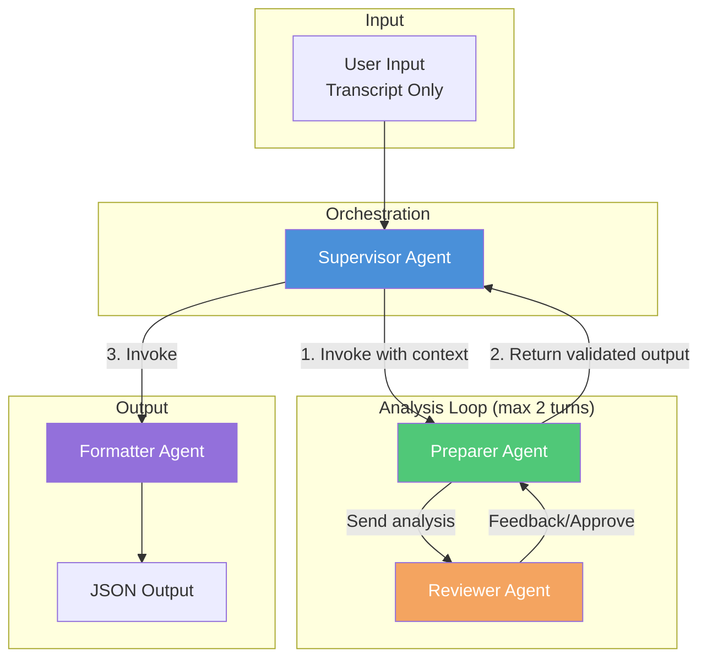
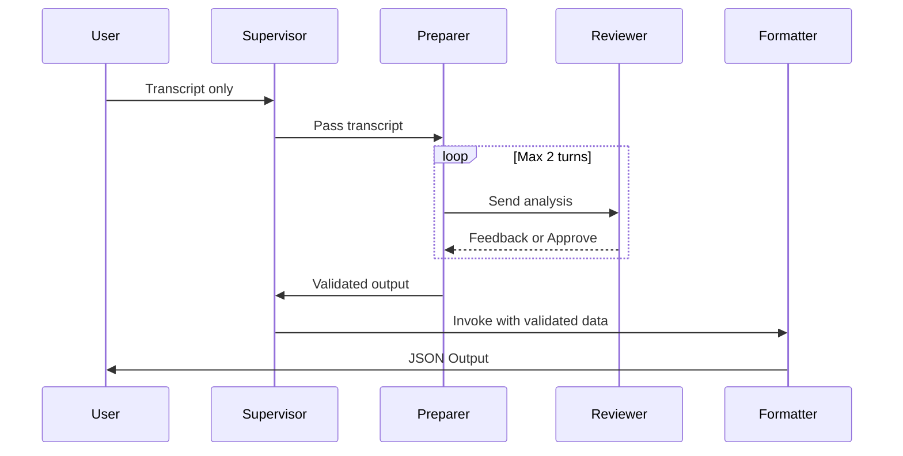
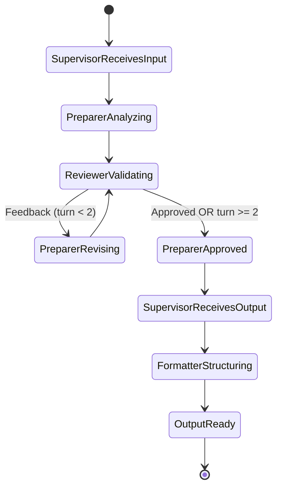

# Agent Orchestration Architecture
**Last Updated:** 2026-04-22  
**Status:** Finalized — based on 2026-04-22 clarifications

---

## Finalized Flow

```
Transcript → Supervisor → Preparer ↔ Reviewer → Preparer → Supervisor → Formatter → JSON Output
```

| Step | From | To | Action |
|------|------|-----|--------|
| 1 | User | Supervisor | Upload transcript |
| 2 | Supervisor | Preparer | Pass transcript |
| 3 | Preparer | Reviewer | Send analysis (against internal framework) |
| 4 | Reviewer | Preparer | Feedback OR Approval (max 2 turns) |
| 5 | Preparer | Supervisor | Return validated output |
| 6 | Supervisor | Formatter | Pass validated output |
| 7 | Formatter | User | JSON Output |

**Key points:**
- User provides **transcript only** — framework is embedded in Preparer and Reviewer
- Reviewer **never** returns to Supervisor — always back to Preparer
- Preparer owns the output and returns it to Supervisor after review approval

---

## Workflow Diagram



---

## Sequence Diagram



---

## Communication Matrix

| From | To | Allowed | Data Passed |
|------|-----|---------|-------------|
| User | Supervisor | ✅ | Transcript only |
| Supervisor | Preparer | ✅ | Transcript |
| Preparer | Reviewer | ✅ | Pain point analysis |
| Reviewer | Preparer | ✅ | Approval or Feedback (max 2 turns) |
| Preparer | Supervisor | ✅ | Validated output |
| Supervisor | Formatter | ✅ | Validated data for structuring |
| Formatter | User | ✅ | Final JSON output |
| Supervisor | Reviewer | ❌ | — |
| Reviewer | Supervisor | ❌ | — |
| Reviewer | Formatter | ❌ | — |

### Framework Location

| Agent | Has Framework? | Purpose |
|-------|----------------|----------|
| Supervisor | ❌ | Orchestration only |
| Preparer | ✅ | Analyze transcript against framework |
| Reviewer | ✅ | Validate analysis against framework |
| Formatter | ❌ | Schema transformation only |

---

## Orchestration Rules

### Turn Limits
```python
MAX_PREPARER_REVIEWER_TURNS = 2
```

### State Machine



---

## Implementation Notes

### OpenAI Agents SDK Pattern

```python
# Supervisor orchestrates via tool calls
supervisor = Agent(
    name="Supervisor",
    instructions="...",
    tools=[preparer.as_tool(), formatter.as_tool()]
)

# Preparer internally manages Reviewer loop
preparer = Agent(
    name="Preparer", 
    instructions="...",
    tools=[reviewer.as_tool()]
)

# Reviewer is a tool of Preparer, not Supervisor
reviewer = Agent(
    name="Reviewer",
    instructions="..."
)

# Formatter is a tool of Supervisor
formatter = Agent(
    name="Formatter",
    instructions="...",
    output_type=PainPointOutput  # Pydantic schema
)
```

### RunConfig Settings
```python
run_config = RunConfig(
    max_turns=10,  # Overall workflow limit
    # Preparer-Reviewer loop limited internally
)
```

---

## Safety Injection Points

| Agent | Safety Controls |
|-------|-----------------|
| **Supervisor** | Instruction hierarchy, scope enforcement |
| **Preparer** | Injection defense (transcript is untrusted), data/instruction separation |
| **Reviewer** | Injection defense (receives Preparer output), validation skepticism |
| **Formatter** | Output integrity, schema enforcement |

### Critical: Preparer ↔ Reviewer Loop

The bidirectional loop between Preparer and Reviewer is the highest-risk surface:
- Injected content from transcript could be passed back and forth
- Each turn could amplify or persist malicious instructions
- **Mitigation:** Both agents need injection defense, loop counter tracking
